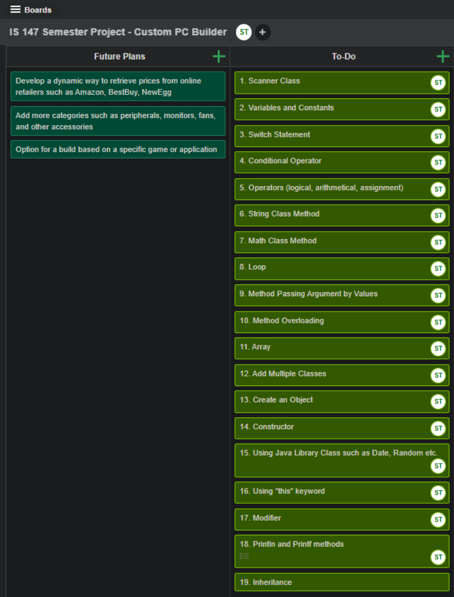

<link rel="stylesheet" type="text/css" href="video-embed.css">

# Intro

This is my biggest project so far in Java. It was a semester-long project for my Intro to Programming course and required me to apply everything I learned from the beginning. The assignment was to create an application that would meet all of the listed criteria and be grand in scope. The expectation was to build an application that was functioning and free of errors, but it did not necessarily have to be a finished product. This allowed me to create a program with a strong foundation of OOP and also left room for further improvements that can be revisited in the future.

# Criteria Checklist

I used KanbanFlow, a workflow management tool, to help organize and monitor my progress throughout the project pipeline. Although I worked individually in creating this application, I still found KanbanFlow to be a very useful way to keep myself in check despite it usually being used for group projects.

# Live Demo
Click on the YouTube video to see a live demo of the application!



# Future Improvements

* Finish Custom PC Builder Class
* Finish Glossary Class
* Add more PC parts such as peripherals, monitors, fans, and other accessories
* Develop a way to dynamically retrieve prices from retailers such as Amazon, BestBuy, and NewEgg (SQL)
* Ability to create a build based on a specific game such as Fortnite, CS:GO, and COD: Warzone
